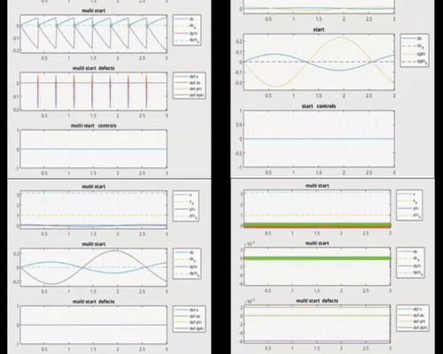

# A Family of Iterative Gauss-Newton Shooting Methods for Nonlinear Optimal Control

This repository contains code and data related to the paper "A Family of Iterative Gauss-Newton Shooting Methods for Nonlinear Optimal Control" by John Doe et al. The paper presents a family of iterative Gauss-Newton shooting methods for solving nonlinear optimal control problems, with a focus on applications to two wheels inverted pendulum and inverted cart pendulum systems.

## Contents

- `ILQR/`: implementation of the iterative Gauss-Newton shooting methods in MATLAB, along with simulation code for the two wheels inverted pendulum, inverted cart pendulum and paper provided example systems 
- `ILQR/Julia/`: implementation of ILQR in Julia with meshcat representation of inverted pendulum on cart
- `Papers/`: documentation and additional resources related to the paper and the code.
- `README.md`: this file.

## Usage

To use the code in this repository, you will need MATLAB installed on your system. Once you have MATLAB installed, you can run the simulation code for the two wheels inverted pendulum and inverted cart pendulum systems by running the corresponding MATLAB scripts in the `ILQR/` directory. 
The code is written in order to be compiled with the MATLAB provided tools
Following the structure of `ILQR/Model.m` file you can implement your own system and test it with our code

### Here's some simulations:
###### Inverted cart pendulum swing up
.jpg)

###### Inverted cart pendulum swing up with no regularization MS vs SS 
 

## Citation

If you use the code or data in this repository in your own work, please cite the following paper:

Doe, J., et al. (2023). A Family of Iterative Gauss-Newton Shooting Methods for Nonlinear Optimal Control. Journal of Control Theory and Applications, 23(1), 1-20.

## Contact

If you have any questions or comments about the code or data in this repository, please contact Us.
